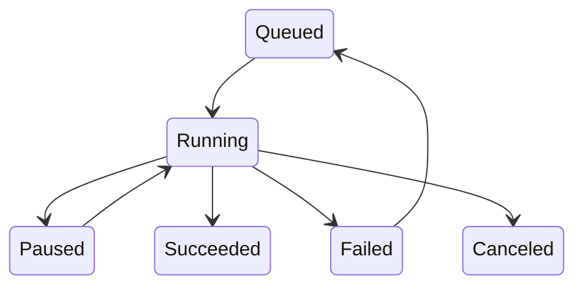

# Operations

```mermaid
stateDiagram-v2
Queued --> Running
Running --> Paused
Paused --> Running
Running --> Succeeded
Running --> Failed
Running --> Canceled
Failed --> Queued
```

目标 SLO 为 API p99 小于 200ms。重点防护路径穿越、恶意编码器参数、超大上传、租户越权与敏感日志。演练 worker 中止、blob 写失败、状态文件损坏和重复 Job；本地仓储使用临时文件加原子 rename，生产使用事务数据库和 outbox。
